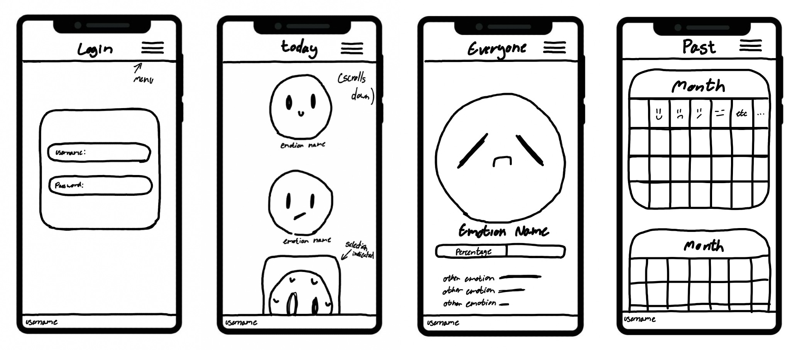
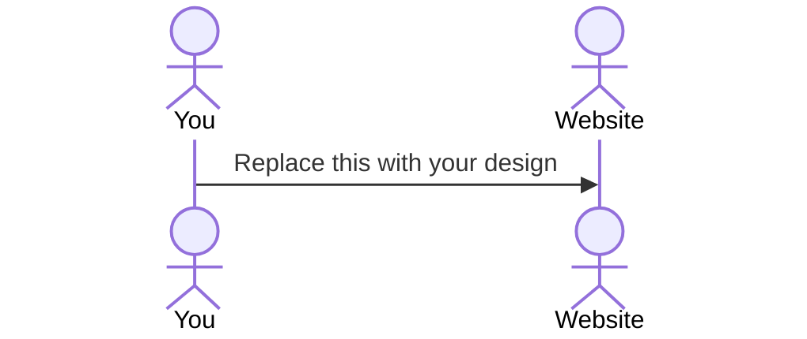

# Your startup name here

[My Notes](notes.md)

A brief description of the application here. Lorem ipsum dolor sit amet, consectetur adipiscing elit, sed do eiusmod tempor incididunt ut labore et dolore magna aliqua. Ut enim ad minim veniam, quis nostrud exercitation ullamco laboris nisi ut aliquip ex ea commodo consequat. Duis aute irure dolor in reprehenderit in voluptate velit esse cillum dolore eu fugiat nulla pariatur. Excepteur sint occaecat cupidatat non proident, sunt in culpa qui officia deserunt mollit anim id est laborum. Hi! I'm modifying this file to practice using the GitHub web console. This will be deleted later.

> [!NOTE]
>  This is a template for your startup application. You must modify this `README.md` file for each phase of your development. You only need to fill in the section for each deliverable when that deliverable is submitted in Canvas. Without completing the section for a deliverable, the TA will not know what to look for when grading your submission. Feel free to add additional information to each deliverable description, but make sure you at least have the list of rubric items and a description of what you did for each item.

> [!NOTE]
>  If you are not familiar with Markdown then you should review the [documentation](https://docs.github.com/en/get-started/writing-on-github/getting-started-with-writing-and-formatting-on-github/basic-writing-and-formatting-syntax) before continuing.

## 🚀 Specification Deliverable

> [!NOTE]
>  Fill in this sections as the submission artifact for this deliverable. You can refer to this [example](https://github.com/webprogramming260/startup-example/blob/main/README.md) for inspiration.

For this deliverable I did the following. I checked the box `[x]` and added a description for things I completed.

- [x] Proper use of Markdown
- [x] A concise and compelling elevator pitch
- [x] Description of key features
- [x] Description of how you will use each technology
- [x] One or more rough sketches of your application. Images must be embedded in this file using Markdown image references.

### Elevator pitch

Here are two things I have noticed about myself: I love getting to look back at my own statistics, and I am *very* emotional. So why not combine the two? I think it be fun to create a website that allows people to track and look back on their daily emotions. This website would allow users to select what they believe to be their strongest emotion of the day once each day. They can then go back and see what their daily emotions have been as time goes on. They can also see what the weather looked like that day, because weather can play a big part in how you are feeling on any given day. In addition to this, users would be able to check out the day’s most commonly chosen emotions based on what was logged by the entire community.

### Design

This is a *very* rough idea of what the website might look like. There would be a page for registering and logging in, a page for choosing the day's emotion, a page showing the day's most popular emotion, and a page showing the user's history. I would like to have a hamburger type of menu to navigate from page to page, but I'm not dead set on it. The emotions would be shown as cute little faces, or possibly just regular old emojis. History would be shown as one calendar-looking screen with the emotion picture and weather symbol shown on each day. All this is what I came up with without really understanding anything, so it is all subject to major changes.  

### Key features

- Secure login over HTTPS
- Ability to select an emotion daily
- Display of selected emotions for previous days as well as the weather that day
- Display of holidays instead of weather with previous emotions if the weather idea doesn't work
- Display of most selected emotion of all users for the current day updated in realtime
- Notification when other users pick a daily emotion if the most common emotion idea doesn't work
- Accounts, emotions, and weather data is stored

### Technologies

I am going to use the required technologies in the following ways.

- **HTML** - Uses correct HTML structure for application. Four HTML pages. One for login, one for emotion selction, one for history, and one for the daily common emotion.
- **CSS** - Application styling that is readable, cute, and looks good regardless of screensize.
- **React** - Provides login, emotion selector, displaying past selections and weather, displaying daily popular emotion, and use of React for routing and components.  
- **Service** - Backend service with endpoints for:
  - register, login, and log out
  - saving daily emotions and weather
  - retrieving previous emotions and weather
  - retrieving daily popular emotion
  - retrieving weather data from a third party
- **DB/Login** - Store users, emotions, and weather data in database. Register and login users. Credentials securely stored in database. Cannot log emotion unless authenticated.
- **WebSocket** - As each user logs an emotion, the most chosen emotion for the current day is updated live and shown to all users.

## 🚀 AWS deliverable

For this deliverable I did the following. I checked the box `[x]` and added a description for things I completed.

- [x] **Server deployed and accessible with custom domain name** - [My server link](https://wood260.click).

## 🚀 HTML deliverable

For this deliverable I did the following. I checked the box `[x]` and added a description for things I completed.

- [x] **HTML pages** - I completed this part of the deliverable.
- [x] **Proper HTML element usage** - I completed this part of the deliverable.
- [x] **Links** - I completed this part of the deliverable.
- [x] **Text** - I completed this part of the deliverable.
- [x] **3rd party API placeholder** - I completed this part of the deliverable.
- [x] **Images** - I completed this part of the deliverable.
- [x] **Login placeholder** - I completed this part of the deliverable.
- [x] **DB data placeholder** - I completed this part of the deliverable.
- [x] **WebSocket placeholder** - I completed this part of the deliverable.

## 🚀 CSS deliverable

For this deliverable I did the following. I checked the box `[x]` and added a description for things I completed.

- [x] **Header, footer, and main content body** - I completed this part of the deliverable.
- [x] **Navigation elements** - I completed this part of the deliverable.
- [x] **Responsive to window resizing** - I completed this part of the deliverable.
- [x] **Application elements** - I completed this part of the deliverable.
- [x] **Application text content** - I completed this part of the deliverable.
- [x] **Application images** - I completed this part of the deliverable.

## 🚀 React part 1: Routing deliverable

For this deliverable I did the following. I checked the box `[x]` and added a description for things I completed.

- [x] **Bundled using Vite** - I completed this part of the deliverable.
- [x] **Components** - I completed this part of the deliverable.
- [x] **Router** - I completed this part of the deliverable.

## 🚀 React part 2: Reactivity deliverable

For this deliverable I did the following. I checked the box `[x]` and added a description for things I completed.

- [ ] **All functionality implemented or mocked out** - I did not complete this part of the deliverable.
- [ ] **Hooks** - I did not complete this part of the deliverable.

## 🚀 Service deliverable

For this deliverable I did the following. I checked the box `[x]` and added a description for things I completed.

- [ ] **Node.js/Express HTTP service** - I did not complete this part of the deliverable.
- [ ] **Static middleware for frontend** - I did not complete this part of the deliverable.
- [ ] **Calls to third party endpoints** - I did not complete this part of the deliverable.
- [ ] **Backend service endpoints** - I did not complete this part of the deliverable.
- [ ] **Frontend calls service endpoints** - I did not complete this part of the deliverable.
- [ ] **Supports registration, login, logout, and restricted endpoint** - I did not complete this part of the deliverable.

## 🚀 DB deliverable

For this deliverable I did the following. I checked the box `[x]` and added a description for things I completed.

- [ ] **Stores data in MongoDB** - I did not complete this part of the deliverable.
- [ ] **Stores credentials in MongoDB** - I did not complete this part of the deliverable.

## 🚀 WebSocket deliverable

For this deliverable I did the following. I checked the box `[x]` and added a description for things I completed.

- [ ] **Backend listens for WebSocket connection** - I did not complete this part of the deliverable.
- [ ] **Frontend makes WebSocket connection** - I did not complete this part of the deliverable.
- [ ] **Data sent over WebSocket connection** - I did not complete this part of the deliverable.
- [ ] **WebSocket data displayed** - I did not complete this part of the deliverable.
- [ ] **Application is fully functional** - I did not complete this part of the deliverable.
