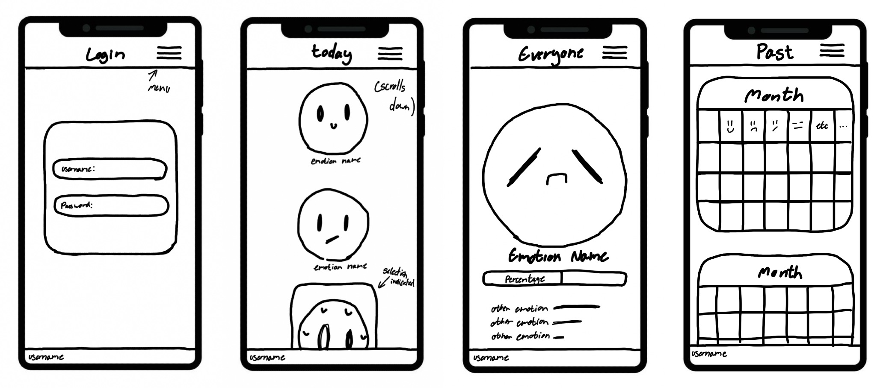

# Name of Startup
## Specification Deliverable
### Elevator Pitch

Have you ever noticed how excited people tend to get when their “Spotify Wrapped” comes out? People seem to love looking back at their own statistics. Because of this, I thought it would be fun to create a website that allows people to track and look back on their daily emotions. This website would allow users to select what they believe to be their strongest emotion of the day once every day. They can then go back and look at what their daily emotions have been as time goes on. In addition to this, users can see the day’s most commonly chosen emotions based on the emotions logged by the entire community.

### Design

This is a very rough general idea of what the website might look like.

### Key features

- Log in
- Ability to select an emotion daily
- Display of all previous daily emotion selections
- Displays most common emotions and their percentage

### Technologies

I think this website will use the required technologies in these ways.

- **Authentication** - Users will create accounts to view their previous days and to log new ones.
- **Database Data** - All the emotions selected will be stored in a database so that users are able to look at their previous selections.
- **WebSocket Data** - The percentage of the most common emotion will be updated and diplayed in real time.

## HTML deliverable

For this deliverable I built out the structure of my application using HTML.

- **HTML pages** - Four HTML pages that represent the ability to login, select an emotion, view previous selctions, and view the most commonly chosen emotion.
- **Links** - All of the pages contain links to every page.
- **Text** - There is text sescribing each of the emotion choices, and the dates in the calendar. I did choose to not type out all of the emotions or dates, as I think those will be subect to a lot of change as I learn how to properly create the website.
- **Images** - A placeholder image was put in for all the places a photo will be. This image is not permanent, and will not be used in the final product.
- **DB/Login** - Input box and submit button for login. The previous emotions (currently shown as nothing but images) displayed in the calendar should represent data pulled from the database.
- **WebSocket** - I still really don't have a clue as to what WebSocket is or how to properly incorperate it. The updating percentage for the most common emotion (currently represetned by the progress bars) is how I am currently attempting to meet this requirement.
